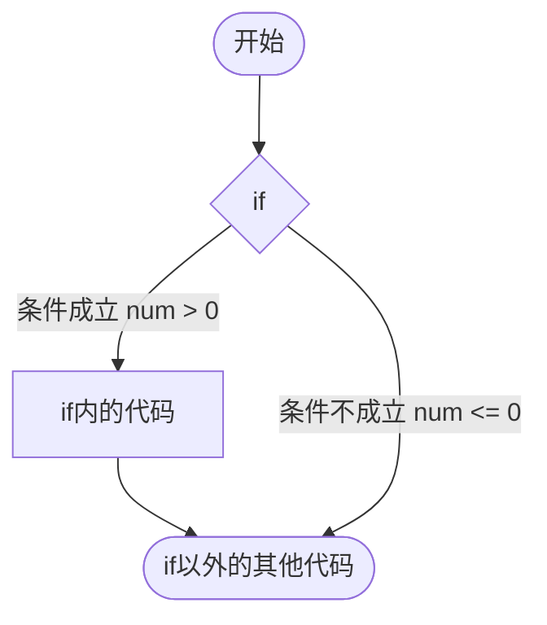
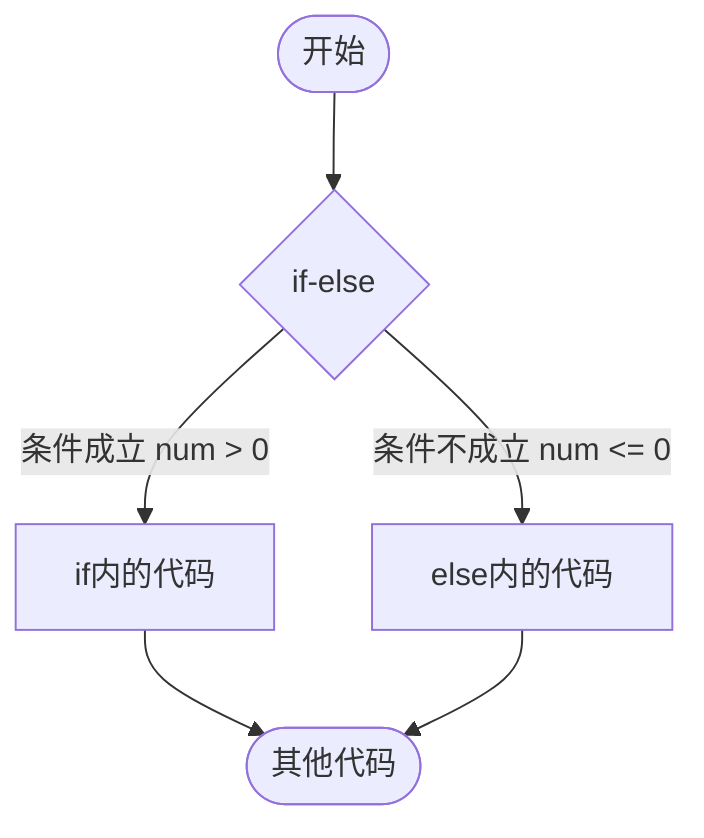
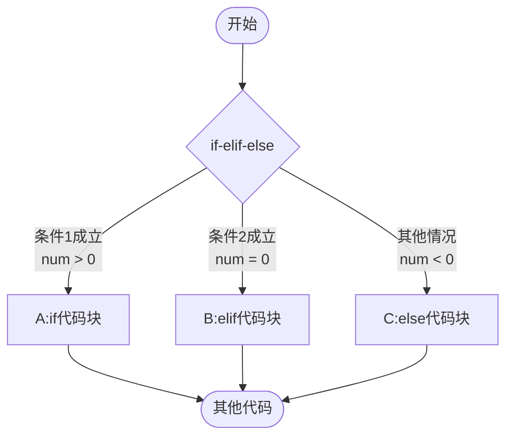

# 速通！！！
~~这篇也是我的语法备忘录~~

章节标签含义：
- ⭐**重要** 不要跳过
- 🔬**困难** 可以跳过
- 💡**简单** 建议不跳过

如果你特别追求 *速度* 和 *简单*，只读带⭐的部分即可

---
## 1. ⭐字面量 (Literal)

没有名字，看**外表**就知道具体值，***字面**意思*。

### ⭐整数(Int)  
- `123`

### 💡十六进制整数(Int)  
`0x`开头，字符范围`0~9` `a~f` `A~F`  
- `0xFFFFF`
- `0xf0000`

### 💡二进制整数(Int)  
`0b`开头，字符范围`0` `1`  
- `0b111000`

### ⭐浮点数(Num)  
即小数，必须带有一个`.`  
- `123.123`
- `123.`(即123.0)
- `.123`(即0.123)

### 💡科学计数法浮点数(Num)
用科学技术法表示的浮点数(*即使实际是整数也会当成浮点数*)  
在浮点数后加上`e`或`E`，再加上一个整数(可携带正负号)  
比如`123.123e3`表示`123.123 * 10^3`即`123123.`  
- `123e3`
- `123.e3`
- `.123e3`
- `123e-3`
- `123e+3`

### 💡颜色值(Col)
表示颜色的值，底层上是Num  
`0c`开头，字符范围`0~9` `a~f` `A~F`，**长度限制**为6或8  

`0c12345678`  
1~2位是红色值  
3~4位是绿色值  
5~6位是蓝色值  
可选的7~8位为透明度值，越大越不透明，默认255(0xFF)
以上取值皆是0~255(0xFF)  

- `0cFF0000`纯红
- `0c00FF007F`半透明绿

### 💡数字分隔符`_`
对于较长、难以辨认的数字可以添加分隔符。

❌
1. 不能在整个数字两端`_123_`
2. 不能在`.` `x b c` `e E` `- +` 两侧`123_._123_e_+3` `0_x_FF`

✅
- `500_000_000.333_444`
- `0xFF_00_7F`
- `2.718_281_828`
- `1e-1_000`

### ⭐字符串 (Str)
一串文本，两侧使用英文引号夹住(_编程界惯例_)  
- `"Hello World"`

**不能跨行**  
❌
```
"Hello
World"
```
需要换行请添加转义符`\n`（`\n`长度为1)  
✅
```
"Hello\nWorld"
```

---
## 2. 注释 (Comment)
注释都以`#`开头。
### ⭐行注释
注释当前行`#`后面的内容，编译器不会解析，字符串里的`#`不生效。
用于标注某些信息 或 使代码失效。
```mlx
a = 1 # a等于1
# b = 2
s = "#hello"
```
↓编译器解析的
```mlx
a = 1
s = "#hello"
```

### 💡多行注释
注释`#*`和`*#`之间的所有内容，编译器不会解析，字符串里的`#*` `*#`不生效，可以跨行。
用于标注某些信息 或 使代码失效。
```mlx
#* 下面的代码包含一个变量
也包含一个字面量
还有一个等号! *#
a = "*#"
#* b = 2
c = 3 *#
```
↓编译器解析的
```mlx
a = "*#"
```

### 🔬文档注释 (Doc Comment)
对于初学者，建议先学习后面部分，适当的时候会有跳转到这里的链接。

---

## 3. ⭐变量 (Variable)

变量就像一个带标签的盒子，你可以往里面放东西（数据），以后可以通过标签找到它。

### 声明变量 (`set`)

在使用一个变量之前，需要先“声明”它，也就是告诉程序“我要一个盒子了”。我们用 `set` 关键字来做这件事。

- `set var` —— 声明一个名为 `var` 的变量

### 赋值 (`=`)

有了盒子，就可以往里面放东西了，这就是“赋值”。用等号 `=`。

- `a = 10` —— 把数字 `10` 放到变量 `a` 里
- `name = "小明"` —— 把字符串 `"小明"` 放到变量 `name` 里

### 声明并赋值

为了更简单，你也可以在声明变量的同时就给它赋值。

- `set age = 18` —— 声明变量 `age` 并把数字 `18` 放进去
- `set pi = 3.14`

变量里的值是可以改变的。

```mlx
set count = 1
print(count) # 输出：1

count = 2
print(count) # 输出：2
```

---

## 4. 链接建筑 (Link)

在Mindustry逻辑中，需要建筑时可以直接写`建筑名+序号`，但在MLogiX，为了防止歧义只允许手动导入。

### 导入建筑
使用`use`来导入，通配符`*`意味着全部导入。

**1. ⭐全部导入**

```mlx
use link.* # 导入全部建筑
```

**2. ⭐部分导入**

```mlx
use link.message1 # 导入单个建筑
```
```mlx
use link.{message1, router1} # 导入两个建筑
use link.{message1 router1} # 可以省略逗号
```

**3. 🔬分组时导入**

如果建筑被IDE分组，情况就比较复杂，不是做专业复杂逻辑蓝图的可以跳过。

假设链接的建筑分组是这样的结构
```
link            #根目录
├── transport   #运输元件组
│   ├── router1 #一个建筑
│   └── router2 #一个建筑
└── message1    #一个建筑
```

**`*`只会导入该组下的建筑和组**
```mlx
use link.*                # 导入了transport和message1
set a = transport.router1 # 只能间接访问
set b = message1          # 直接访问
```
**你可以使用`**`跳过组导入全部建筑**
```mlx
use link.**      # 导入了router1, router2, message1，但没有导入transport
set a = router1  # 直接访问
set b = message1 # 直接访问
```

**也可以使用嵌套引入**
```mlx
use link.{
    transport.router1 # 导入router1，但没有导入transport
    message1
}
```

### 💡给建筑起别名
导入时使用`as`可以给建筑起别名，原名不被占用。用于从名字上更清晰地指出建筑的作用。
```mlx
use link.message1 as out # 导入message1并改名为out，表示这个信息板用于输出信息
set a = out              # ✅
set b = messasge1        # ❌找不到`message1`的标识符
set message1             # ⚠️合法，但可能引起误会
```
```mlx
use link.{
    message1 as out # 用于输出信息
    message2 as log # 用于输出日志
}
```

---

## 5. 打印 (Print)

打印是逻辑输出信息最简单的方式。

### ⭐打印单个值
使用`print(...)`把文本放入文本缓冲区，`println(...)`会额外添加换行符`\n`，
使用`printf(...)`输出到信息板并清空缓冲区。
```mlx
use link.message1

set name = "RGBaaa"
print("Hello")      # 打印字面量
print(name)         # 打印变量
println(255)        # 打印数字并附带换行符（自动转换类型）
printf(message1)    # 真正输出到信息板并清空缓冲区

#* 信息板内容：
HelloRGBaaa255
                    # 这有一个空行
```

### ⭐打印多个值
`print(...)`和`println(...)`的括号里可以填多个值
```mlx
use link.message1

set name = "RGBaaa"
println("Hello" name 255) # 可以省略逗号
printf(message1)

#* 信息板内容：
HelloRGBaaa255
                          # 这有一个空行
```

### 💡分隔符
`print(...)`和`println(...)`都可以添加`seq="..."`来设置分隔符
```mlx
use link.message1

set name = "RGBaaa"
print(seq=" ", "Hello" name 255) # 可以省略逗号，分隔符改为空格，
printf(message1)                    

#* 信息板内容：
Hello RGBaaa 255
```

*后续的print语句省略导入和`printf(...)`，实际编写请写上*

---

## 6. 运算 (Operation)

### ⭐基本运算 (Basic Operations)

| 符号   | 名称 | 示例                                   |       结果       | 补充         |
|------|----|:-------------------------------------|:--------------:|:-----------|
| `+`  | 加  |                                      |                |            |
| `-`  | 减  |                                      |                |            |
| `*`  | 乘  |                                      |                |            |
| `/`  | 除  |                                      |                |            |
| `**` | 幂  | `2 ** 3`                             |       8        |            |
| `%`  | 取余 | `3 % 2`<br/>`-3 % 2`<br/>`3 % -2`    | 1<br/>-1<br/>1 | 结果符号取决于被除数 |
| `%%` | 取模 | `3 %% 2`<br/>`-3 %% 2`<br/>`3 %% -2` | 1<br/>1<br/>-1 | 结果符号取决于除数  |
| `//` | 整除 | `101 // 10`<br/>`-101 // 10`         |   10<br/>-11   | 除后向下取整     |

*类似数学公式，连续幂的顺序是从右往左算：`2 ** 3 ** 2` == `2 ** (3 ** 2)` == `512`*

### 🔬位运算 (Bitwise Operations)

*这部分可以跳过*

位运算是直接对数字的二进制位进行操作。

*以下运算包含符号位*

| 符号    | 名称    | 示例        | 二进制运算过程                                      |   十进制结果    |
|:------|:------|:----------|:---------------------------------------------|:----------:|
| `&`   | 按位与   | `5 & 3`   | `0101` & `0011` = `0001`                     |    `1`     |
| `\|`  | 按位或   | `5 \| 3`  | `0101` \| `0011` = `0111`                    |    `7`     |
| `^`   | 按位异或  | `5 ^ 3`   | `0101` ^ `0011` = `0110`                     |    `6`     |
| `<<`  | 左移    | `5 << 1`  | `0101` << 1 = `1010`                         |    `10`    |
| `>>`  | 右移    | `5 >> 1`  | `0101` >> 1 = `0010`<br/>(左侧补符号位)            |    `2`     |
| `>>>` | 无符号右移 | `-5 >> 1` | `111...1011` >>> 1 = `011...1101`<br/>(左侧补0) | 2147483645 |
| `~`   | 按位非   | `~5`      | ~`000...101` = `111...010`                   |    `-6`    |

---

## 7. ⭐类型系统 (Type System)

MLogiX是一门静态类型语言，每个值都有它的类型。
但你基本不用自己写，因为大多数时候聪明的编译器帮你自动补充了变量的类型。

**类型**根据可能性个数分为两种
- **单一类型** (Single Type)：只可能是这种类型，拥有该类型的一切
- **联合类型** (Union Type )：可能是多种单一类型的其中一种，拥有这些类型共有的东西

*暂时不用深入理解*


### ⭐内置类型(Builtin Type)
- `Unknown` 未知，当你声明类型而不显式写出类型时编译器所暂时赋予的类型
- `Num` 浮点数
- `Int` 整数
- `Bool` 布尔类型
- `Null` 空，它的值只有`null`
- `Str` 字符串
- ......还有很多，以后会遇到

### 💡类型标注(Type Annotation)

*完善的类型推导系统有点难做，暂时需要较多类型标注*

有时候你需要手动标注类型，告诉编译器正确的道路

**1. 标注单一类型**

在变量或者字面量后加上`:`和类型。
```mlx
set a : Int      # 标注变量a为整数类型的变量
print(123 : Int) # 标注字面量123是整数，实际上根本不需要，仅作语法参考
```

**2. 标注联合类型**

在变量后加上`:`和多个类型，类型之间用`|`分隔，表示或，多种类型可能。
```mlx
set a : Num | Str # 标注变量a可能是数字或者字符串
```

**3. 标注`Null`类型**

有时变量可能是空值`null`，那么变量就需要一个`Null`类型。
```mlx
set a : Str | Num | Null # 标注变量a可能是字符串或者空值
```

MLogiX也提供了简化写法：在类型前加`?`，表示"是否是空值?"
```mlx
set a : ? Str | Num      # 同上
```

---

## 8. ⭐条件跳转 (Conditional Jump)

程序有时候需要根据情况走不同的路，这时就需要`if`语句。

### 布尔值 (`true` 和 `false`)

判断的结果要么正确，要么错误。
- `true` 表示真，正确，成立
- `false` 表示假，错误，不成立

`true`和`false`同属于`Bool`这个类型

### 比较运算符

这些运算符用来比较两个东西，结果是一个布尔值。

| 运算符   | 名称    | 示例                    | 结果                 |
|:------|:------|:----------------------|:-------------------|
| `==`  | 等于    | `3 == 3`<br/>`3 == 4` | `true`<br/>`false` |
| `!=`  | 不等于   | `3 != 4`              | `true`             |
| `>`   | 大于    | `5 > 3`               | `true`             |
| `<`   | 小于    | `5 < 3`               | `false`            |
| `>=`  | 大于等于  | `5 >= 5`              | `true`             |
| `<=`  | 小于等于  | `4 <= 3`              | `false`            |
| `===` | 严格等于  | `3 === 3`             | `true`             |
|       |       | `3 === "3"`           | `false`（类型不同）      |
| `!==` | 严格不等于 | `3 !== "3"`           | `true`（类型不同）       |
|       |       | `3 !== 3`             | `false`            |

### 逻辑运算符

这些运算符专门计算布尔值，结果也是布尔值。

| 运算符    | 名称  | 示例                                   | 结果                  |
|:-------|:----|:-------------------------------------|:--------------------|
| `&&`   | 逻辑与 | `true && false`<br/>`true && true`   | `false`<br/>`true`  |
| `\|\|` | 逻辑或 | `false && false`<br/>`true && false` | `false`<br/>`true`  |
| `!`    | 逻辑非 | `!false`<br/>`!true`                 | `true`<br/>`!false` |

### 条件跳转语句 if / elif / else

有了判断的条件，我们就可以写分支了。

**1. if**

接受一个条件，***如果***条件为真，则执行接下来的代码块，执行完会继续执行后续代码。

> **代码块** —— 用`{` 和 `}`包住的一段代码

语法：`if` 条件 `{` 如果成立则执行的代码 `}`

示例：
```mlx
if num > 0 {
    println("变量num是正数")
}
print("结束")
```

如果`num = 5`则输出：
```
变量num是正数
结束
```

如果`num = -5`则输出：
```
结束
```

把`if`语句画成流程图：


**2. else**

上面判断数字的例子里，我们无法在`num <= 0`时执行其他语句，如果需要就需要使用`else`语句。

当`num`为***其他***取值时，也就是`num <= 0`时，程序会执行与`if`相连的`else`代码。

语法：`if` 条件 `{` 成立时代码 `}` `else` `{` 不成立时代码 `}`

示例：
```mlx
if num > 0 {
    println("变量num是正数")
} else {
    println("变量num不是正数")
}
print("结束")
```

如果`num = 5`则输出：
```
变量num是正数
结束
```

如果`num = -5`则输出：
```
变量num不是正数
结束
```

把`if-else`语句画成流程图：


**3. elif**

`if-else`的例子中，我们解决了**是与不是**(`num > 0`和`num <= 0`)分别怎么做的问题，
如果想更进一步，在`num > 0` `num = 0` `num < 0`三种情况都进行输出，那就需要`elif`语句了。

作用：添加新条件、新分支。

语法示例：
```mlx
if num > 0 {
    println("变量num是正数")
} elif num = 0 {
    println("变量num是0")
} else {
    println("变量num是负数")
}
print("结束")
```

行为：


更进一步，还可以添加更多`elif`语句，添加更多分支。
*但`if` `else`在一整个条件跳转语句中只能分别有一个*

- `if` 后面跟条件，如果条件为 `true`，就执行它后面 `{ ... }` 里的代码。
- `elif` 是“else if”的缩写，表示“如果前面的不成立，再试试这个条件”。
- `else` 表示“以上条件都不成立”，就执行它里面的代码。

**4. 嵌套**


---

## 9. 运算顺序

```
最高优先级（先算）
    ↑
    ├─ ⭐括号 只能用  ( )
    │
    ├─ 一元运算符（无优先级顺序）
    │  ├── ⭐相反数    -
    │  ├── ⭐逻辑非    !
    │  ├── 🔬按位非    ~
    │  └── 🔬引用      &
    │
    ├─ ⭐基本二元运算
    │  ├── 幂运算       **
    │  ├── 乘除         *  /  %  %%  //
    │  └── 加减         +  -
    │
    ├─ 🔬位运算
    │  ├── 移位         <<  >> >>>
    │  ├── 按位与        &
    │  ├── 按位异或      ^
    │  └── 按位或        |    
    │
    ├─ ⭐比较运算        ==  !=  >  <  >=  <=  ===  !==
    │
    ├─ ⭐逻辑运算        &&  ||
    │
    ├─ ⭐赋值            =
    ↓
最低优先级（后算）
```

*类似数学公式，连续幂的顺序是从右往左算：`2 ** 3 ** 2` == `2 ** (3 ** 2)` == `512`*


*如果你拿捏不定，可以按照自己期望的运算顺序添加小括号`()`，IDE会帮你删除多余括号*

## ⭐10. 循环 (Loop)

程序很擅长做重复的事情，循环就是用来干这个的。

### while 循环

接受一个条件，当条件为真，就***循环***执行接下来的代码块。

```mlx
set i = 1
while i <= 5 {
    print("这是第", i, "次循环")
    i = i + 1   # 别忘了更新变量，不然会无限循环下去！
}
# 输出：
# 这是第 1 次循环
# 这是第 2 次循环
# 这是第 3 次循环
# 这是第 4 次循环
# 这是第 5 次循环
```

只要 `i <= 5` 这个条件为真，花括号里的代码就会一遍又一遍地执行。每次循环我们让 `i` 增加 `1`，直到它变成 `6`，条件为假，循环就结束了。

### for 循环

`for` 循环是一种更“聪明”的循环，专门用来处理需要计次或遍历一系列值的情况。我们有几种写法：

**1. 循环固定次数**

如果单纯想重复做某件事5次：

```mlx
for 5 {
    print("Hello!")
}
# 输出5次 Hello!
```

**2. 使用区间 `:=`**

`i in 0 := 5` 的意思是让 `i` 依次取`>= 0` 且 `<= 5`的**整数**
也就是`0, 1, 2, 3, 4，5` 这几个值，然后执行循环体。

```mlx
for i in 0 := 5 {
    print("当前值：", i)
}
# 输出：
# 当前值：0
# 当前值：1
# 当前值：2
# 当前值：3
# 当前值：4
# 当前值：5
```

**3. 使用区间 `:<`**

`i in 0 :< 5` 的意思是让 `i` 依次取`>= 0` 且 `< 5`的**整数**
也就是`0, 1, 2, 3, 4` 这几个值，然后执行循环体。

```mlx
for i in 0 :< 5 {
    print("当前值：", i)
}
# 输出：
# 当前值：0
# 当前值：1
# 当前值：2
# 当前值：3
# 当前值：4
```

你可能会好奇，`:=`好端端的为什么要弄个`:<`左闭右开的区间呢？实际上，`:<`反而是最常用的区间表示方法。
